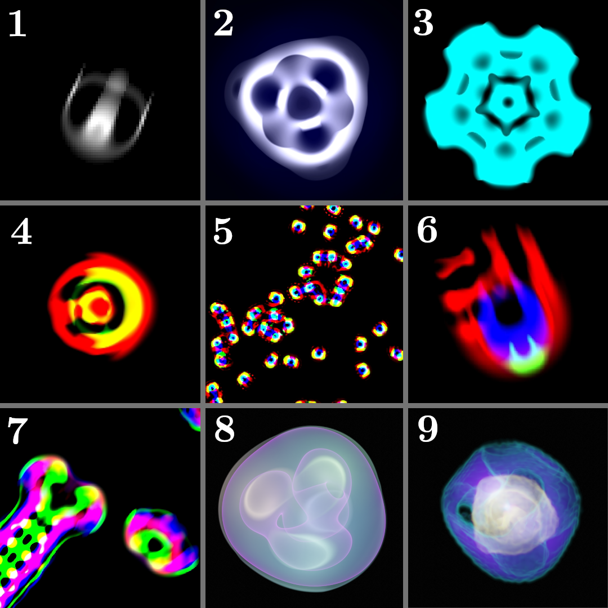

# Birdbrain's Lenia renderer
This repository contains my quick and dirty "workspace" to explore the [Standard Lenia](https://arxiv.org/abs/1812.05433) and [Expanded Lenia](https://arxiv.org/abs/2005.03742) cellular automata systems. The code is written purely in Rust and uses [lenia_ca](https://github.com/BirdbrainEngineer/lenia_ca) crate by your's truly to simulate the systems. Since the ``lenia_ca`` crate makes heavy use of [ndarray](https://docs.rs/ndarray/latest/ndarray/) crate, then you should also familiarize yourself with that.

It is recommended that instead of using this Lenia renderer, you make your own, as this renderer is extremely unoptimized and rather slow. You can simply use the ``lenia_ca`` crate for the backend simulation.

I also created a video, which can be found on [YouTube](https://www.youtube.com/channel/UCZDOT6k11nLH3ZwA6Xp89NA), which displays plenty of animations made with this workspace. 

1. Orbium unicaudatus - The iconic Lenia glider
2. Tricircium inversus - An oscillator with 3-fold symmetry
3. Astrium inversus - An oscillator with 5-fold symmetry
4. A generic glider arising from a 2-channel & 2-kernel interaction
5. Lots of multi-channel & multi-kernel interacting "single cell organisms"
6. An asymmetric glider arising from complex set of channels and kernels.
7. "Snakes and Parasites"
8. Tetrahedrome rotans - A 3D rotating oscillator with interesting symmetries (rendered with blender)
9. A 3D slice of a chaotic oscillator in 4D (rendered with Blender)